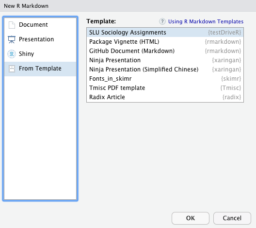

# testDriveR 


[](https://cran.r-project.org/package=testDriveR)
[](https://cran.r-project.org/web/checks/check_results_testDriveR.html)
[](https://www.r-pkg.org/pkg/testDriveR)
[](https://zenodo.org/badge/latestdoi/95270521)

The goal of `testDriveR` is to provide data sets for teaching statistics and data science courses. This package includes a sample of data from John Edmund Kerrich's famous coin flip experiment. These are data that I used for teaching [SOC 4015 / SOC 5050](https://slu-soc5050.github.io) at [Saint Louis University](https://www.slu.edu).

The package also includes an R Markdown template for completing assignments. This was the *required* format for authoring R Markdown documents in my courses [SOC 4015 / SOC 5050](https://slu-soc5050.github.io) and [SOC 4650 / SOC 5650](https://slu-soc5650.github.io) at [Saint Louis University](https://www.slu.edu). A quick overview is included below.

## Installation

The easiest way to get `testDriveR` is to install it from CRAN:

``` r
install.packages("testDriveR")
```

You can also install the development version of `testDriveR` from [Github](https://github.com/chris-prener/testDriveR) with `remotes`:

```{r gh-installation, eval = FALSE}
remotes::install_github("chris-prener/testDriveR")
```

## Current Data
The package currently contains five data tables:

* `auto17` - A data set containing model year 2017 vehicles for sale in the United States
* `childMortality` - A data set containing childhood mortality time series data by country from UNICEF
* `gss14` - A data set containing a selection of variables related to work and education from the 2014 General Social Survey
* `gss14_simple` - A simple version of `gss14` without factors created and without missing data explicitly declared
* `kerrich` - A data set containing 2000 trials of coin flips by [John Edmund Kerrich](https://en.wikipedia.org/wiki/John_Edmund_Kerrich)

### Usage
Once loaded, the data contained in `testDriveR` can be loaded into data frames in your global environment and then explored. For example, to load the `auto17` data:

```r
library("testDriveR")
autoData <- auto17
str(autoData)
```

### Data Creation
If you are interested in the original data/code used to create the included data, you can find them at:

* `auto17` is documented in [Chris's `autoData` repository](https://github.com/chris-prener/autoData)
* `childMortality` is documented in [Chris's `childMortality` repository](https://github.com/chris-prener/childMortality)
* `gss14` and `gss14_simple` are documented in [Chris's `gss14` repository](https://github.com/chris-prener/gss14)
* `kerrich` is documented in the [`extdata` directory](https://github.com/chris-prener/testDriveR/blob/main/inst/extdata/kerrich.R)

## R Markdown Template
The package also includes a template that my students use for getting started with `R` based assignments. It can be accessed from within RStudio by going to `File > New File > R Markdown...` and then selecting `SLU Sociology Assignments` under `Template`:



The template includes `YAML` for generating both `.nb.html` and `.md` output, a pre-formatted date that updates each time the document is knit, and initial code blocks for loading dependencies and data.

## Contributor Code of Conduct
Please note that this project is released with a [Contributor Code of Conduct](CODE_OF_CONDUCT.html). By participating in this project you agree to abide by its terms.
